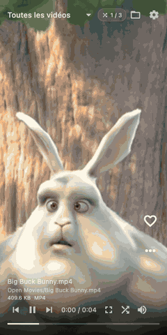

<div align="center">
  
  <h1>ReelDeck</h1>
  <p>Choisissez un dossier. Mélangez. Balayez.</p>
  <p>
    <a href="README.md">English</a> · 
    <a href="README_zh.md">简体中文</a> · 
    <a href="README_ja.md">日本語</a> · 
    <a href="README_es.md">Español</a> · 
    <a href="README_fr.md">Français</a>
  </p>
  <p>
    <a href="https://github.com/laull9/ReelDeck/actions/workflows/release.yml"></a>
    
    
  </p>
  <p><a href="https://github.com/laull9/ReelDeck/releases">Téléchargements</a> · <a href="DESIGN.md">Conception du produit</a> · <a href="docs/releases.md">Build & Publication</a> · <a href="TODO.md">Vérifications</a></p>
</div>

<p align="center">
  
</p>
<p align="center"><sub>Séquences de démonstration : extraits de <em>Big Buck Bunny</em>, <em>Sintel</em> et <em>Tears of Steel</em> © Blender Foundation, <a href="https://creativecommons.org/licenses/by/3.0/deed.fr">CC BY 3.0</a>. Pour régénérer : <code>python3 scripts/record_readme_demo.py</code>.</sub></p>

ReelDeck lit directement vos fichiers multimédias originaux. Compatible avec les disques locaux, les disques durs externes et les dossiers Android SAF, il indexe rapidement votre contenu et lit les vidéos en boucle aléatoire sans doublon. Pas de compte, pas de synchronisation cloud, pas de télémétrie.

## Fonctionnalités

- **Lecture aléatoire** : Mélange cryptographique Fisher–Yates par défaut sans répétition au sein d'une série.
- **Préchargement bidirectionnel** : File circulaire à 3 lecteurs (précédent et suivant) pour des transitions immédiates sans écran noir ni scintillement d'image.
- **Décodage optimisé** : Profils d'accélération matérielle (`auto`, `auto-safe`, `no`) avec recherche rapide et affichage immédiat de la première image.
- **Périmètre de lecture** : Tout, favoris, un dossier ou sous-dossier spécifique. Les vidéos ou dossiers masqués restent exclus.
- **Ordre de lecture** : Aléatoire, Aléatoire intelligent (entrelacement des dossiers), Plus récents d'abord, Plus anciens d'abord.
- **Contrôles vidéo** : Lecture/pause, barre de progression interactive, vitesse x2 temporaire sur appui long, muet, plein écran et 3 modes d'affichage.
- **Reprise de lecture** : Conserve la file actuelle, la position de lecture, les favoris et les dossiers masqués.
- **Images & GIF** : Prise en charge optionnelle avec minuterie configurable, pause et défilement.
- **Gestion des dossiers** : Multi-dossiers, actualisation automatique à l’ouverture de l’app ou à l’activation d’un dossier (désactivable), réanalyse manuelle, gestion souple des volumes déconnectés.
- **Actions de fichiers** : Afficher dans l'explorateur de fichiers et déplacer vers la corbeille système sur ordinateur.
- **Interface épurée** : Informations complètes, barre seule ou sans interface. Raccourcis clavier entièrement configurables.
- **Multilingue** : Détection automatique de la langue du système ou sélection manuelle dans les paramètres (anglais, chinois simplifié, japonais, espagnol, français).

Formats vidéo supportés : MP4, MKV, MOV, M4V, WebM, AVI, MPG, MPEG, TS, M2TS, FLV, WMV. Images : JPG, JPEG, PNG, WebP, BMP, GIF (jusqu'à 64 Mo par fichier).

## Téléchargement & Installation

Téléchargez la version adaptée à votre matériel depuis les [Releases](https://github.com/laull9/ReelDeck/releases) :

| Plateforme | x64 | ARM64 |
| --- | --- | --- |
| Windows | `ReelDeck-windows-x64.zip` | `ReelDeck-windows-arm64.zip` |
| macOS | `ReelDeck-macos-x64.zip` | `ReelDeck-macos-arm64.zip` |
| Linux deb | `ReelDeck-linux-x64.deb` | `ReelDeck-linux-arm64.deb` |
| Linux rpm | `ReelDeck-linux-x64.rpm` | `ReelDeck-linux-arm64.rpm` |
| Android | ARMv7 : `ReelDeck-android-armv7.apk` | `ReelDeck-android-arm64.apk` |

Sur Windows, installez le [composant redistribuable Microsoft Visual C++ v14](https://learn.microsoft.com/cpp/windows/latest-supported-vc-redist), extrayez l'archive et lancez `reel_deck.exe`. Sur macOS, glissez `ReelDeck.app` dans le dossier Applications.

Sur Linux (Ubuntu 24.04) :

```sh
# Debian / Ubuntu
sudo apt install ./ReelDeck-linux-arm64.deb

# Fedora / RPM
sudo dnf install ./ReelDeck-linux-arm64.rpm
```

Android nécessite Android 7.0 (API 24) ou une version plus récente.

## Utilisation

Ouvrez l'application et ajoutez un dossier multimédia. La lecture commence dès la fin de l'indexation.

Défilez vers le bas pour la vidéo suivante, vers le haut pour la précédente. Faites glisser la vidéo vers le haut pour révéler la suivante, ou vers le bas pour revenir à la précédente. Touchez pour lire/mettre en pause, double-touchez pour ajouter aux favoris, maintenez enfoncé pour la vitesse 2x.

| Raccourci par défaut | Action |
| --- | --- |
| `↓` / `J` | Vidéo suivante |
| `↑` / `K` | Vidéo précédente |
| `Espace` | Lecture / Pause |
| `←` / `→` | Reculer / Avancer de 5s |
| `Shift + ←` / `Shift + →` | Reculer / Avancer de 15s |
| `F` | Basculer favori |
| `H` / `Shift + H` | Masquer vidéo / Masquer dossier |
| `R` | Réorganiser la file |
| `M` | Activer/désactiver le son |
| `Entrée` / `Échap` | Basculer plein écran |
| `I` | Basculer les informations |

## Développement local

Développé avec Flutter 3.47.5 / Dart 3.13.4, media_kit / libmpv, Drift / SQLite, Provider et les canaux de plateforme natifs.

```sh
flutter pub get --enforce-lockfile
flutter analyze --no-pub
flutter test --no-pub
flutter run -d macos
```

Génération de code Drift :

```sh
dart run build_runner build --delete-conflicting-outputs
```
