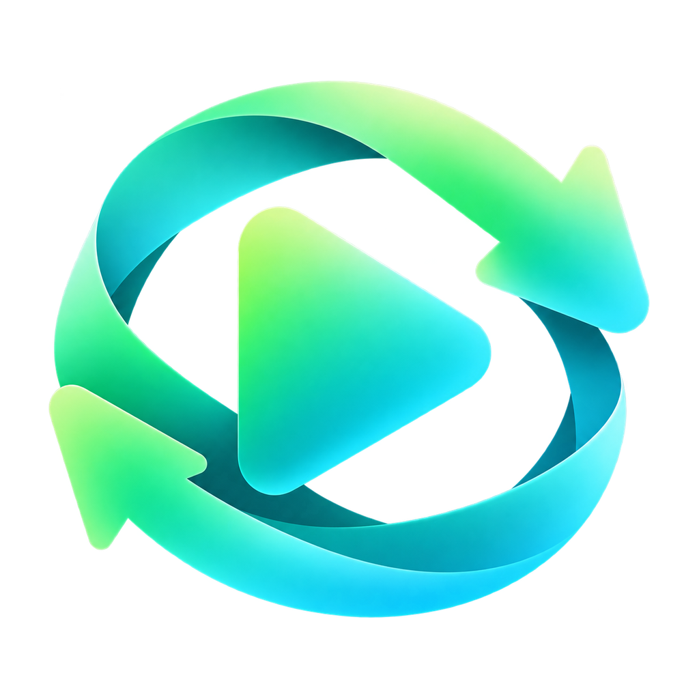

<div align="center">
  
  <h1>ReelDeck</h1>
  <p>フォルダを選んで、シャッフル、スワイプ。</p>
  <p>
    <a href="README.md">English</a> · 
    <a href="README_zh.md">简体中文</a> · 
    <a href="README_ja.md">日本語</a> · 
    <a href="README_es.md">Español</a> · 
    <a href="README_fr.md">Français</a>
  </p>
  <p>
    <a href="https://github.com/laull9/ReelDeck/actions/workflows/release.yml"></a>
    
    
  </p>
  <p><a href="https://github.com/laull9/ReelDeck/releases">ダウンロード</a> · <a href="DESIGN.md">設計</a> · <a href="docs/releases.md">ビルドとリリース</a> · <a href="TODO.md">検証ログ</a></p>
</div>

ReelDeck はオリジナルの動画ファイルを直接再生します。ローカルフォルダ、外付けドライブ、Android SAF フォルダに対応し、重複のないランダム再生を実現します。アカウント作成、クラウド同期、データ収集は一切行いません。

## 主な機能

- **シャッフル再生**: 暗号学的に安全な Fisher–Yates アルゴリズムで生成。1巡内の重複を防ぎ、再シャッフル時も直前の動画が連続しないよう制御。
- **スムーズな先行読み込み**: 前後方向の3プレイヤー循環バッファにより、次の動画と前の動画を事前にロード。黒画面や残像のちらつきなしに即時切り替え。
- **デコード最適化**: ハードウェアアクセラレーション（Auto、Auto-Safe、ソフトウェア）と分析最適化により高速なシークと初期フレーム表示を実現。
- **再生スコープ**: 全体、お気に入り、特定フォルダ、サブフォルダ。非表示設定された動画やフォルダは、新しいファイルが追加されても非表示を維持。
- **再生順序**: 完全ランダム、スマートランダム（親フォルダを分散）、最新順、古い順。
- **動画操作**: 再生/一時停止、プログレスバー操作、長押しによる2倍速、ミュート、全画面、3種類の画面フィット（収める、全体、オリジナルサイズ）。
- **レジューム**: アプリ再起動後も現在のキュー、再生位置、お気に入り、非表示状態を復元。
- **画像・GIF**: 設定で有効化可能。表示タイマーによる自動送りや一時停止、シークに対応。
- **フォルダ管理**: 複数フォルダ登録、手動再スキャン、再帰スキャンの個別設定。ドライブ切断時の安全な一時停止と自動復帰。
- **ファイル操作**: デスクトップ環境でファイルマネージャーでの表示やゴミ箱への移動に対応（Android SAF はフォルダ非表示を推奨）。
- **シンプルなUI**: フル情報、プログレスバーのみ、オーバーレイなしの3モード。キーボードショートカットのカスタマイズ対応。
- **多言語対応**: システム言語の自動検出および設定での手動切り替え（英語、簡体字中国語、日本語、スペイン語、フランス語）。

対応動画形式: MP4, MKV, MOV, M4V, WebM, AVI, MPG, MPEG, TS, M2TS, FLV, WMV (libmpv 準拠)。対応画像形式: JPG, JPEG, PNG, WebP, BMP, GIF (最大 64 MiB)。

## ダウンロードとインストール

[Releases](https://github.com/laull9/ReelDeck/releases) からお使いの環境に合ったパッケージを選択してください:

| プラットフォーム | x64 | ARM64 |
| --- | --- | --- |
| Windows | `ReelDeck-windows-x64.zip` | `ReelDeck-windows-arm64.zip` |
| macOS | `ReelDeck-macos-x64.zip` | `ReelDeck-macos-arm64.zip` |
| Linux deb | `ReelDeck-linux-x64.deb` | `ReelDeck-linux-arm64.deb` |
| Linux rpm | `ReelDeck-linux-x64.rpm` | `ReelDeck-linux-arm64.rpm` |
| Android | ARMv7: `ReelDeck-android-armv7.apk` | `ReelDeck-android-arm64.apk` |

Windows は [Microsoft Visual C++ v14 再頒布可能パッケージ](https://learn.microsoft.com/cpp/windows/latest-supported-vc-redist) をインストールし、ZIP を解凍して `reel_deck.exe` を起動します。macOS は `ReelDeck.app` をアプリケーションフォルダに移動します。

Linux (Ubuntu 24.04 準拠):

```sh
# Debian / Ubuntu
sudo apt install ./ReelDeck-linux-arm64.deb

# Fedora / RPM
sudo dnf install ./ReelDeck-linux-arm64.rpm
```

Android は Android 7.0 (API 24) 以降が必要です。

## 使い方

アプリを起動して動画フォルダを追加します。スキャン完了後、すぐに再生が始まります。

下へスクロールすると次へ、上へスクロールすると前へ。動画を上にドラッグして次を表示し、下にドラッグして前に戻ります。タップで再生/一時停止、ダブルタップでお気に入り、長押しで2倍速、横ドラッグでシーク。

| デフォルトショートカット | 操作 |
| --- | --- |
| `↓` / `J` | 次の動画 |
| `↑` / `K` | 前の動画 |
| `Space` | 再生 / 一時停止 |
| `←` / `→` | 5秒戻る / 進む |
| `Shift + ←` / `Shift + →` | 15秒戻る / 進む |
| `F` | お気に入り登録 / 解除 |
| `H` / `Shift + H` | 動画を非表示 / フォルダを非表示 |
| `R` | キューを再シャッフル |
| `M` | ミュート切替 |
| `Enter` / `Esc` | 全画面表示の切替 |
| `I` | 情報表示の切替 |

## ローカル開発

Flutter 3.47.5 / Dart 3.13.4, media_kit / libmpv, Drift / SQLite, Provider を使用。

```sh
flutter pub get --enforce-lockfile
flutter analyze --no-pub
flutter test --no-pub
flutter run -d macos
```

Drift テーブル定義のコード生成:

```sh
dart run build_runner build --delete-conflicting-outputs
```
